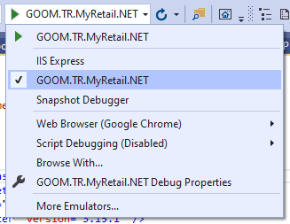
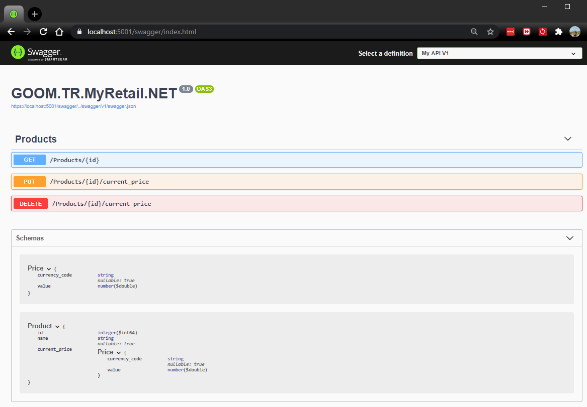

# Getting Started

## Docker:

First things first, install Docker for your operating system. Instructions for [Windows](https://docs.docker.com/docker-for-windows/install/), [Mac](https://docs.docker.com/docker-for-mac/install/) and [Linux](https://docs.docker.com/docker-for-mac/install/) are readily available available.

### Docker Compose:

Next, open a command line shell, switch to the main project directory and run `docker-compose up`. This will start up all the backing services required for the code to run. These are defined in the [docker-compose.yml](../src/docker-compose.yml) file.

Additional details regarding docker-compose can be found [here](https://docs.docker.com/compose/).

## Run Application (.NET CORE):

There are numerous tutorials on how to run to .NET Core applications if you're new to the ecosystem. However, the a few examples below.

#### 1) Visual Studio

- Install and start [Visual Studio](https://docs.microsoft.com/en-us/visualstudio/install/install-visual-studio)
- Open the solution file [GOOM.TR.MyRetail.NET.sln](../src/net/GOOM.TR.MyRetail.NET/GOOM.TR.MyRetail.NET.sln) in Visual Studio
- Run the project
    - Make sure to select the stand alone executable instead of IIS Express, see:
    - 

#### 2) .NET CLI:

- Install the [.NET Core CLI](https://dotnet.microsoft.com/download/dotnet-core/3.1)
- Open up a command prompt and navigate to the project folder
   - `cd \src\net\GOOM.TR.MyRetail.NET\GOOM.TR.MyRetail.NET`
- Run the project
   - `dotnet run -c Release`

### Swagger:

Once you have the application running, navigate to the swagger endpoint. This will enable you easily interact with the rest endpoints. 

When running locally, this can be reached at https://localhost:5001/swagger/index.html

A deployed instance is accessible at http://gideonogega.com/Target_MyRetail/swagger/index.html

#### Additional Notes:

See [here](https://www.blazemeter.com/blog/getting-started-with-swagger-ui/) for additional examples on how to use Swagger and [here](https://swagger.io/tools/swagger-ui/) live demos.

### Run Tests:

As with running the application, there are several ways to run tests. The two most common are below:

#### 1) Visual Studio

- Open the solution file [GOOM.TR.MyRetail.NET.sln](../src/net/GOOM.TR.MyRetail.NET/GOOM.TR.MyRetail.NET.sln) in Visual Studio
- Right click on the test project _**GOOM.TR.MyRetail.NET.Tests**_ and click _**Run Unit Tests**_

#### 2) .NET CLI:

- Open up a command prompt and navigate to the project folder
   - `cd src\net\GOOM.TR.MyRetail.NET\GOOM.TR.MyRetail.NET.Tests`
- Run the project
   - `dotnet test`

